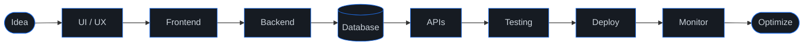
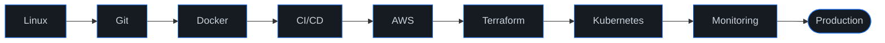

<table>
<tr>
<td align="center" valign="middle" width="260">

</td>
<td align="left" valign="middle">

<h1>Deepak Jadon</h1>
<h3>Full Stack Developer &nbsp;·&nbsp; MERN &nbsp;·&nbsp; Cloud &amp; DevOps</h3>

Building modern, scalable, secure and high-performance web applications.

 

</td>
</tr>
</table>

---

## 👨‍💻 About Me

<table>
<tr><td width="230"><b>🔭 Currently working on</b></td><td>Full Stack web applications using React, TypeScript, Node.js, MongoDB, Supabase and Tailwind CSS, focused on performance optimization, secure authentication and scalable architecture.</td></tr>
<tr><td><b>👯 Looking to collaborate on</b></td><td>Remote or freelance Full Stack / Frontend projects, startups, SaaS products and real-world applications that solve meaningful problems.</td></tr>
<tr><td><b>🤝 Looking for help with</b></td><td>Advanced system design, cloud scalability and improving CI/CD pipelines for production-ready applications.</td></tr>
<tr><td><b>🌱 Currently learning</b></td><td>Advanced React patterns, backend optimization, PostgreSQL, system design concepts and best practices for high-performance web apps.</td></tr>
<tr><td><b>💬 Ask me about</b></td><td>React, TypeScript, Tailwind CSS, REST APIs, JWT authentication, MongoDB, Supabase, performance optimization and building full-stack projects from scratch.</td></tr>
<tr><td><b>⚡ Fun fact</b></td><td>I love turning complex ideas into simple, fast and user-friendly interfaces, and I've improved real-world app performance by up to 40% 🚀</td></tr>
</table>

---

## ⚡ Tech Stack

<table>
<tr>
<td width="170"><b>🔥 Most used</b></td>
<td>
 
My daily drivers: <code>React</code> · <code>TypeScript</code> · <code>Node.js</code>
</td>
</tr>
<tr>
<td><b>🎨 Frontend</b></td>
<td>
 
<code>React Router</code> · <code>Zustand</code> · <code>React Query</code> · <code>Framer Motion</code> · <code>Radix UI</code> · <code>shadcn/ui</code>
</td>
</tr>
<tr>
<td><b>⚙️ Backend</b></td>
<td>
 
<code>REST APIs</code> · <code>JWT</code> · <code>RBAC</code> · <code>Authentication</code> · <code>Webhooks</code> · <code>API Architecture</code>
</td>
</tr>
<tr>
<td><b>🗄️ Databases</b></td>
<td></td>
</tr>
<tr>
<td><b>☁️ Cloud &amp; DevOps</b></td>
<td>
 
<code>CI/CD</code> · <code>Infrastructure as Code</code> · <code>Containers</code> · <code>Automation</code>
</td>
</tr>
<tr>
<td><b>🧰 Dev Tools</b></td>
<td></td>
</tr>
<tr>
<td><b>🧪 Testing</b></td>
<td>

 
<code>Unit</code> · <code>API</code> · <code>E2E</code> · <code>Concurrency</code> · <code>Performance</code>
</td>
</tr>
<tr>
<td><b>🔌 Integrations</b></td>
<td>

</td>
</tr>
</table>

---

## 🚀 Featured Projects

<table>
<tr>
<td width="50%" valign="top">

### 🛒 BrajMart
**Production E-Commerce Platform**

A real-world full-stack e-commerce platform built for scalable product management, checkout, inventory and production operations.

- Product catalog, collections, search and filtering
- Inventory management with stock reservation
- Cart and checkout validation
- Razorpay payments and Cash on Delivery
- Verified purchase reviews
- Admin dashboard, inventory history and audit logs
- SEO architecture, structured data and sitemap

<code>React</code> · <code>TypeScript</code> · <code>Node.js</code> · <code>Express</code> · <code>MySQL</code> · <code>Tailwind</code> · <code>Zustand</code> · <code>React Query</code> · <code>Vercel</code> · <code>Render</code>

</td>
<td width="50%" valign="top">

### 🏨 Vrindavan Sarthi
**Travel & Hospitality Platform**

A complete booking ecosystem for hotels, rooms, cabs and tours.

- Hotel management, room types and room inventory
- Room-unit booking with daily availability and booking locks
- Razorpay payments and cancellation workflow
- Email invoices
- Partner and admin dashboards with booking calendar
- Cab booking and tour booking

<code>React</code> · <code>TypeScript</code> · <code>Vite</code> · <code>Node.js</code> · <code>Express</code> · <code>MongoDB</code> · <code>Tailwind</code> · <code>Razorpay</code>

</td>
</tr>
<tr>
<td width="50%" valign="top">

### 📈 Liklet
**Digital Growth Platform**

Full-stack platform for managing growth services across multiple social platforms.

- Dynamic services and pricing plans
- Checkout and payment workflow
- Receipt generation
- Admin dashboard
- Responsive UI and production deployment

<code>React</code> · <code>TypeScript</code> · <code>Node.js</code> · <code>Express</code> · <code>MongoDB</code> · <code>Tailwind</code>

</td>
<td width="50%" valign="top">

### ⚡ Performance Engineering
I focus on how applications perform in real production environments.

- Core Web Vitals, LCP and CLS optimization
- JavaScript and bundle reduction
- DOM optimization
- Responsive images and lazy loading
- SSR / prerendering
- API and runtime optimization
- SEO and accessibility

</td>
</tr>
</table>

---

## 🏗️ How I Build

---

## ☁️ Cloud & DevOps Journey

**Currently strengthening:** Linux administration · AWS IAM · VPC · EC2 · S3 · RDS · ALB · ECR · CloudWatch · Docker · GitHub Actions · Terraform · Kubernetes · CI/CD pipelines · Infrastructure automation

---

## 📊 GitHub Analytics

  

<picture>
  <source media="(prefers-color-scheme: dark)" srcset="https://raw.githubusercontent.com/deepakjadon1902/deepakjadon1902/output/github-contribution-grid-snake-dark.svg"/>
  <source media="(prefers-color-scheme: light)" srcset="https://raw.githubusercontent.com/deepakjadon1902/deepakjadon1902/output/github-contribution-grid-snake.svg"/>
  
</picture>

---

## 🎯 Current Focus

| Area | Currently Focused On |
|:--|:--|
| ⚛️ Frontend | Advanced React Architecture |
| 🔷 Type Safety | TypeScript |
| ⚙️ Backend | Node.js + Express |
| 🗄️ Databases | MongoDB · MySQL · PostgreSQL |
| 🔐 Security | JWT · RBAC · Secure APIs |
| 🧪 Testing | Playwright · Vitest |
| ⚡ Performance | Core Web Vitals |
| 🔎 SEO | Technical SEO |
| ☁️ Cloud | AWS |
| 🐳 Containers | Docker |
| 🔄 CI/CD | GitHub Actions |
| 🏗️ IaC | Terraform |
| ☸️ Orchestration | Kubernetes |
| 🧠 Architecture | System Design |

---

## 💡 What I Like Building

🛒 E-Commerce Platforms &nbsp;·&nbsp; 🏨 Booking Systems &nbsp;·&nbsp; 📊 Admin Dashboards &nbsp;·&nbsp; 🚀 SaaS Applications 
⚡ High-Performance Frontends &nbsp;·&nbsp; 🔐 Secure Backend APIs &nbsp;·&nbsp; ☁️ Cloud-Native Apps 
📱 Responsive Web Apps &nbsp;·&nbsp; 🧩 Full-Stack Business Systems

 

**Clean Code · Simple Architecture · Fast Interfaces · Secure APIs · Accurate Data · Production-Ready Systems · Continuous Optimization**

---

## 🤝 Open To

## 🌐 Connect With Me

  

<!--
=====================================================================
SNAKE WORKFLOW (kept here so everything lives in one file)

GitHub only runs workflows from their own file. Copy everything between
the START and END lines into a new file in this repo named:

    .github/workflows/snake.yml

Then open the Actions tab, run "Generate Contribution Snake" once.

---- START ----
name: Generate Contribution Snake

on:
  schedule:
    - cron: "0 0 * * *"
  workflow_dispatch:
  push:
    branches:
      - main

permissions:
  contents: write

jobs:
  generate:
    runs-on: ubuntu-latest
    steps:
      - name: Generate GitHub Contribution Snake
        uses: Platane/snk/svg-only@v3
        with:
          github_user_name: deepakjadon1902
          outputs: |
            dist/github-contribution-grid-snake.svg
            dist/github-contribution-grid-snake-dark.svg?palette=github-dark

      - name: Push Snake to Output Branch
        uses: crazy-max/ghaction-github-pages@v4
        with:
          build_dir: dist
          branch: output
        env:
          GITHUB_TOKEN: ${{ secrets.GITHUB_TOKEN }}
---- END ----
=====================================================================
-->
